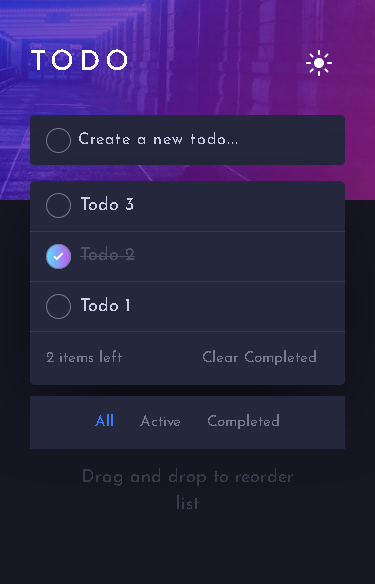
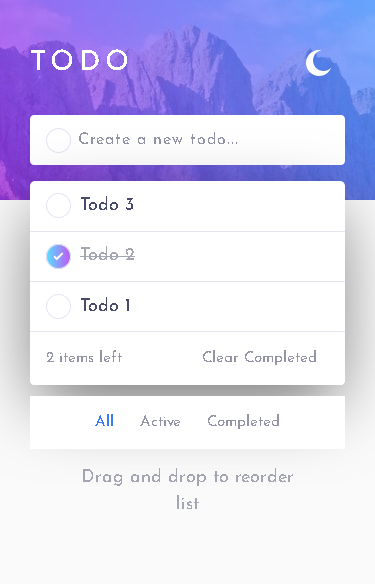
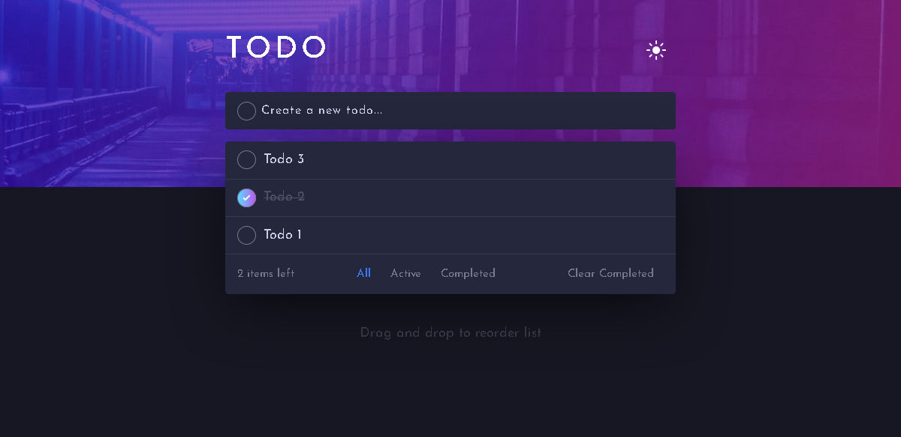
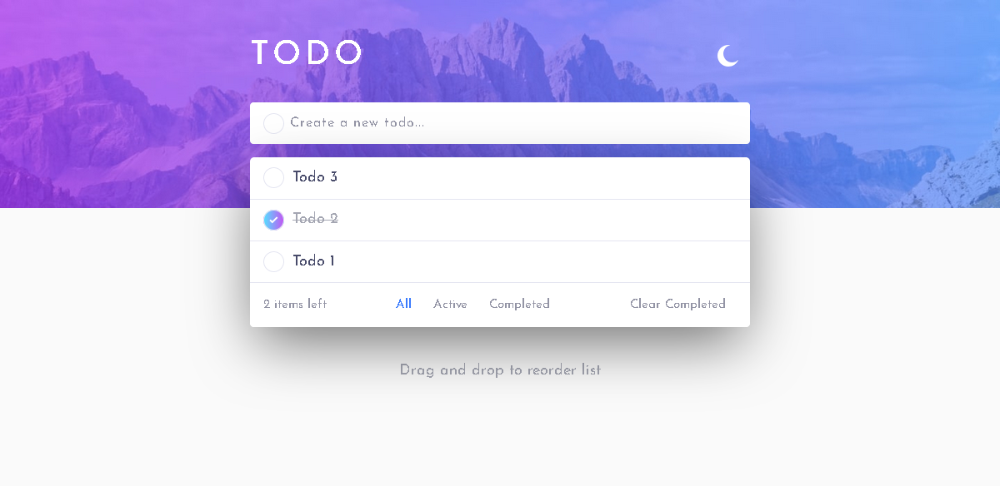

# Frontend Mentor - Todo app solution

This is a solution to the [Todo app challenge on Frontend Mentor](https://www.frontendmentor.io/challenges/todo-app-Su1_KokOW). Frontend Mentor challenges help you improve your coding skills by building realistic projects. 

## Table of contents

- [Overview](#overview)
  - [The challenge](#the-challenge)
  - [Screenshot](#screenshot)
  - [Links](#links)
  - [Built with](#built-with)
  - [Useful resources](#useful-resources)
  - [Author](#author)

## Overview

### The challenge

Users should be able to:

- View the optimal layout for the app depending on their device's screen size
- See hover states for all interactive elements on the page
- Add new todos to the list
- Mark todos as complete
- Delete todos from the list
- Filter by all/active/complete todos
- Clear all completed todos
- Toggle light and dark mode
- **Bonus**: Drag and drop to reorder items on the list

### Screenshot

### Links

- Solution URL: [Click here](https://www.frontendmentor.io/solutions/localstorage-theme-select-sort-by-drag-responsive-mobile-first-JmARO8_00)
- Live Site URL: [Click here](https://hatwell-jonel.github.io/frontendmentor-todoapp/)

### Built with

- Semantic HTML5 markup
- SCSS
- Bootstrap 5
- JavaScript

### Useful resources

- [Resources](https://www.frontendmentor.io/solutions/to-do-app-6Mwj0-ISw) - This solution also from frontendmentor helps me to javascript logic of the app.

## Author

- LinkedIn - [Jonel Hatwell](https://www.linkedin.com/in/jonel-hatwell/)
- Frontend Mentor - [@hatwell-jonel](https://www.frontendmentor.io/profile/hatwell-jonel)

